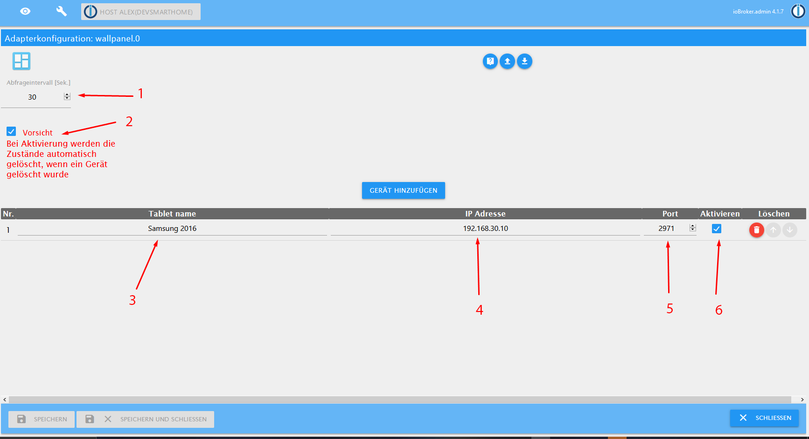
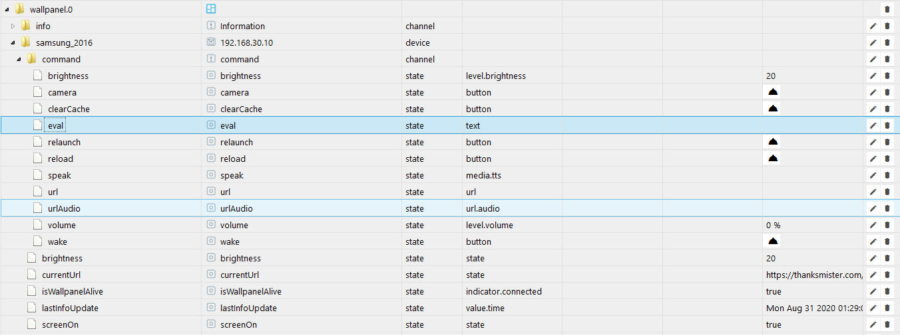
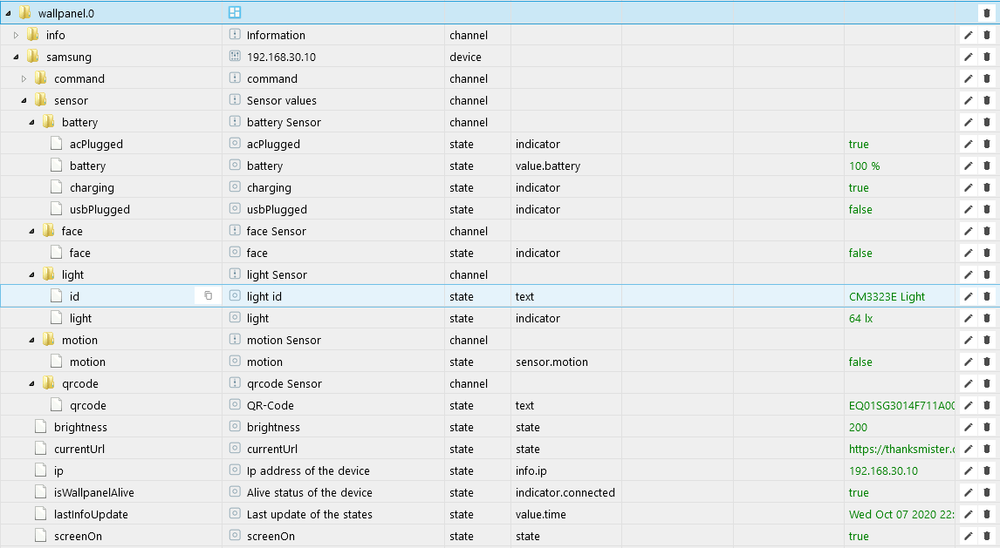

# ioBroker.wallpanel

**Tests:**: 

## **Sentry**
**Dieser Adapter verwendet Sentry-Bibliotheken, um Ausnahmen und Codefehler automatisch an die Entwickler zu melden.**  
Weitere Details und Informationen zum Deaktivieren der Fehlerberichterstattung finden Sie in der 
[Sentry-Plugin-Dokumentation](https://github.com/ioBroker/plugin-sentry#plugin-sentry)  
Sentry Reporting wird ab js-controller 3.0 verwendet.

## Adapter Beschreibung
Der Adapter liest die [Wallpenel app Android](https://play.google.com/store/apps/details?id=com.thanksmister.iot.wallpanel&hl=de) 
aus und trägt es in Datenpunkte ein.  
Man kann auch ein paar Funktionen steuern, wie z.B. die Helligkeit.  
Es können mehrere Device abgefragt bzw. gesteuert werden.  
Hier ist der [Forum Post](https://forum.iobroker.net/topic/36438/test-adapter-wallpanel)

## Config
Noch Kurtz zu der Config Seite was man einstellen muss.

1. Hier wird der Abfrageintervall festgelegt **(Achtung nicht unter 10 sec einstellen)**.
2. Hier kann man dem Adapter sagen, dass er die Datenpunkte automatisch löschen kann, wen das Device aus der Liste entfernt wurde **(Standard aus)**.
3. Hier wird der Name von eurem Devise eingetragen (dieser wird dann für die Erstellung der Devise Ordner in den Datenpunkten verwendet).
4. Hier wird die Ip Adresse von eurem Device das ihr Abfragen bzw. Steuern wollt eingetragen **(wenn kein Name für das Devise eingetragen wurde, wird die Ip für die Devise Ordner verwendet)**.
5. Hier trage ihr den Port denn ihr in der Wallpanel app vergeben habt **Standard ist 2971**.
6. Hier kann man das Device von der Abfrage Deaktivieren, ohne es zu löschen.

## State Übersicht
Hier eine Übersicht über die Stats.

#### Command's:
* brightness ===> Helligkeit von 0 bis 255
* camera ===> aktiviert / deaktiviert das Kamera-Streaming und fordert die Aktivierung der Kamera.
* clearCache ===> löscht den Browser-Cache.
* eval ===> wertet JavaScript im Dashboard aus z.B. **alert('Hello World!')**.
* relaunch ===> startet das Dashboard über die konfigurierte launch URL neu.
* reload ===> lädt die aktuelle Seite sofort neu.
* speak ===> verwendet das TTS des Geräts, um die Nachricht zu sprechen.
* url ===> Navigieren Sie sofort zu einer neuen URL.
* urlAudio ===> Spielen Sie das durch die URL angegebene Audio sofort ab.
* volume ===> ändert die Lautstärke, Wert 0–100 (in%. Wirkt sich nicht auf die TTS-Lautstärke aus).
* wake ===> weckt den Bildschirm, wenn er ausgeschaltet ist.

#### Abfrage der states
* brightness ===> aktueller Helligkeitswert des Bildschirms.
* currentUrl ===> Aktuelle URL, die angezeigt wird.
* ip ===> Ip Adresse vom dem Device.
* isWallpanelAlive ===> kommt vom Adapter und zeigt an, ob das Devise erreichbar ist.
* lastInfoUpdate ===> kommt vom Adapter und zeigt an, wann die letzte Aktualisierung der states war.
* screenOn ===> zeigt an ob der Bildschirm grade an ist

#### MQTT Adapter states Abfrage
##### Achtung mqtt.0 Adapter muss dafür installiert und eingerichtet sein und MQTT in der WallPanel App eingerichtet sein.

## Changelog
 <!--
 Placeholder for the next version (at the beginning of the line):
 ### __WORK IN PROGRESS__ (- falls nicht benötigt löschen sonst klammern entfernen und nach dem - dein text schreiben)
 -->
### __WORK IN PROGRESS__
* (xXBJXx) Added MQTT states query
* (xXBJXx) GitHub Actions added
### 0.1.3-0 (2020-09-08)
* (xXBJXx) code update

### 0.1.2-0 (2020-09-05)
* (xXBJXx) Dependency update and release
### 0.1.1
* (xXBJXx) added IP address datapoint
* (xXBJXx) wake state edit

### 0.1.0
* (xXBJXx) Revised code
* (xXBJXx) Documentation added
* (xXBJXx) lastInfoUpdate state added

### 0.0.2
* (xXBJXx) first Beta

### 0.0.1
* (xXBJXx) initial release

## License
MIT License

Copyright (c) 2020 xXBJXx

Permission is hereby granted, free of charge, to any person obtaining a copy
of this software and associated documentation files (the "Software"), to deal
in the Software without restriction, including without limitation the rights
to use, copy, modify, merge, publish, distribute, sublicense, and/or sell
copies of the Software, and to permit persons to whom the Software is
furnished to do so, subject to the following conditions:

The above copyright notice and this permission notice shall be included in all
copies or substantial portions of the Software.

THE SOFTWARE IS PROVIDED "AS IS", WITHOUT WARRANTY OF ANY KIND, EXPRESS OR
IMPLIED, INCLUDING BUT NOT LIMITED TO THE WARRANTIES OF MERCHANTABILITY,
FITNESS FOR A PARTICULAR PURPOSE AND NONINFRINGEMENT. IN NO EVENT SHALL THE
AUTHORS OR COPYRIGHT HOLDERS BE LIABLE FOR ANY CLAIM, DAMAGES OR OTHER
LIABILITY, WHETHER IN AN ACTION OF CONTRACT, TORT OR OTHERWISE, ARISING FROM,
OUT OF OR IN CONNECTION WITH THE SOFTWARE OR THE USE OR OTHER DEALINGS IN THE
SOFTWARE.